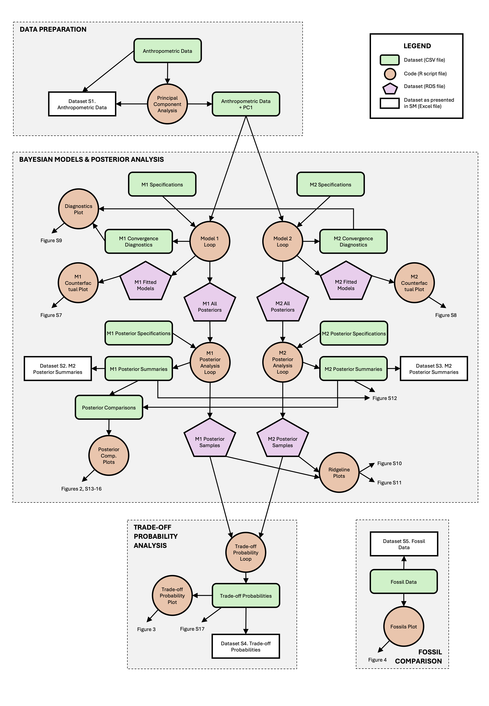

# Data and R scripts for the paper ‘No evidence for a trade-off between climbing and bipedal performance in the skeletal proportions of human athletes’

This repository contains data and scripts used in the following paper:

PLACEHOLDER FOR PAPER REFERENCE

This repository is organised into three main folders by file type: CSV, R Code, and PNG Figures. Many of these are produced by the code, while others represent original input data. The full pipeline also produces six RDS files for use in later steps - these are not included since they exceed the GitHub filesize limit, but can be downloaded here: https://zenodo.org/records/20313479

See below for a pipeline overview diagram and component table. Note that some figure plot codes produce plots within an R plot window rather than as PNG output files.

All codes are very quick to run, except for the two model fitting loops that each took in the region of a couple of hours.



| ID | File Type / Folder | File Name                    | Model Relevance | Description/Function                                                                                         | Input Files (ID)         | Output Files (ID)             |
|----|--------------------|------------------------------|-----------------|--------------------------------------------------------------------------------------------------------------|--------------------------|-------------------------------|
| A  | CSV                | anthropometric_data          | Both            | Dataset of sample data                                                                                       | -                        | -                             |
| B  | Code               | principal_component_analysis | Both            | Calculates PCA based on skeletal body proportions and adds PC1 to dataframe as variable for use in models    | A                        | -                             |
| C  | CSV                | anthropometric_data_PC1      | Both            | Dataset of sample data with added variable of PC1 for chosen skeletal variables                              | -                        | -                             |
| D  | CSV                | m1_model_specifications      | Model 1         | Dataset listing variables and respective model variants to be run within the M1 Model Loop code              | -                        | -                             |
| E  | CSV                | m2_model_specifications      | Model 2         | Dataset listing variables and respective model variants to be run within the M2 Model Loop code              | -                        | -                             |
| F  | Code               | m1_fitting_loop              | Model 1         | Fits M1 models for all focal conditions                                                                      | C, D                     | H, K, O                       |
| G  | Code               | m2_fitting_loop              | Model 2         | Fits M2 models for all focal conditions                                                                      | C, E                     | I, L, P                       |
| H  | CSV                | m1_convergence_diagnostics   | Model 1         | Dataset of convergence diagnostics for fitted M1 models                                                      | -                        | -                             |
| I  | CSV                | m2_convergence_diagnostics   | Model 2         | Dataset of convergence diagnostics for fitted M2 models                                                      | -                        | -                             |
| J  | Code               | diagnostics_plot             | Both            | Produces plot of convergence diagnostics for each model                                                      | H, I                     | Figure S9 (R plot call)       |
| K  | RDS                | m1_fitted_models             | Model 1         | Dataset of full ulam model objects for each fitted M1 model                                                  | -                        | -                             |
| L  | RDS                | m2_fitted_models             | Model 2         | Dataset of full ulam model objects for each fitted M2 model                                                  | -                        | -                             |
| M  | Code               | m1_counterfactual_plot       | Model 1         | Produces example counterfactual plot of fitted model for M1. Set to plot the most complex model              | K                        | Figure S7 (R plot call)       |
| N  | Code               | m2_counterfactual_plot       | Model 2         | Produces example counterfactual plot of fitted model for M2. Set to plot the most complex model              | L                        | Figure S8 (R plot call)       |
| O  | RDS                | m1_all_posteriors            | Model 1         | Dataset of MCMC posterior draws for every parameter in each fitted M1 model                                  | -                        | -                             |
| P  | RDS                | m2_all_posteriors            | Model 2         | Dataset of MCMC posterior draws for every parameter in each fitted M1 model                                  | -                        | -                             |
| Q  | CSV                | m1_posterior_specifications  | Model 1         | Dataset listing the parameters /parameter differences to be sampled in the M1 Posterior Analysis Loop        | -                        | -                             |
| R  | CSV                | m2_posterior_specifications  | Model 2         | Dataset listing the parameters /parameter differences to be sampled in the M2 Posterior Analysis Loop        | -                        | -                             |
| S  | Code               | m1_posterior_analysis_loop   | Model 1         | Calculates specified posterior statistics from all M1 posterior samples                                      | O, Q                     | U, W                          |
| T  | Code               | m2_posterior_analysis_loop   | Model 2         | Calculates specified posterior statistics from all M2 posterior samples                                      | P, R                     | V, X                          |
| U  | CSV                | m1_posterior_summaries       | Model 1         | Dataset of posterior summary statistics for specified parameters/parameter differences of all M1 models      | -                        | -                             |
| V  | CSV                | m2_posterior_summaries       | Model 2         | Dataset of posterior summary statistics for specified parameters/parameter differences of all M2 models      | -                        | -                             |
| W  | RDS                | m1_posterior_samples         | Model 1         | Dataset of posterior samples for specified parameters/parameter differences of all M1 models                 | -                        | -                             |
| X  | RDS                | m2_posterior_samples         | Model 2         | Dataset of posterior samples for specified parameters/parameter differences of all M2 models                 | -                        | -                             |
| Y  | CSV                | posterior_comparisons        | Both            | Dataset of specified posteriors for posterior comparison plots                                               | Made manually from U & V | -                             |
| Z  | Code               | posterior_comparison_plots   | Both            | Produces plots of climb-bipedal sport posterior comparisions                                                 | Y                        | Figures 2, S13-16 (PNG files) |
| AA | Code               | ridgeline_plots              | Both            | Produces ridgeline plots of all posteriors/posterior comparisions of interest. Run separately for each model | W, X                     | Figure S10-11 (PNG files)     |
| AB | Code               | tradeoff_probabilies_loop    | Both            | Calculates trade-off probabilities from posterior samples of MCMC paired climb versus bipedal sports         | W, X                     | AC                            |
| AC | CSV                | tradeoff_probabilities       | Both            | Dataset of trade-off probabilities from posterior samples of MCMC paired climb versus bipedal sports         | -                        | -                             |
| AD | Code               | tradeoff_probabailities_plot | Both            | Produces plot of trade-off probabilities across each climb-bipedal comparison                                | -                        | Figure 3 (R plot call)        |
| AE | CSV                | fossil_data                  | NA              | Dataset of mass and stature data from study sample and fossils (externally sourced; see methods)             | -                        | -                             |
| AF | Code               | fossils_plot                 | NA              | Produces plot of mass versus stature across fossil hominins in comparison to study sample                    | AE                       | Figure 4 (R plot call)        |


# R Session Info & ‘rethinking’ Installation

```
R version 4.6.0 (2026-04-24)
Platform: aarch64-apple-darwin23
Running under: macOS Tahoe 26.1

Matrix products: default
BLAS:   /System/Library/Frameworks/Accelerate.framework/Versions/A/Frameworks/vecLib.framework/Versions/A/libBLAS.dylib 
LAPACK: /Library/Frameworks/R.framework/Versions/4.6/Resources/lib/libRlapack.dylib;  LAPACK version 3.12.1

locale:
[1] en_US.UTF-8/en_US.UTF-8/en_US.UTF-8/C/en_US.UTF-8/en_US.UTF-8

time zone: Europe/London
tzcode source: internal

attached base packages:
[1] parallel  stats     graphics  grDevices utils     datasets  methods   base     

other attached packages:
 [1] here_1.0.2      ggridges_0.5.7  lubridate_1.9.5 forcats_1.0.1   stringr_1.6.0   purrr_1.2.2    
 [7] tidyr_1.3.2     tibble_3.3.1    tidyverse_2.0.0 ggrepel_0.9.8   ggplot2_4.0.3   digest_0.6.39  
[13] rethinking_2.42 posterior_1.7.0 cmdstanr_0.8.0  dplyr_1.2.1     readr_2.2.0    

loaded via a namespace (and not attached):
 [1] gtable_0.3.6         shape_1.4.6.1        tensorA_0.36.2.1     xfun_0.57           
 [5] devtools_2.5.2       remotes_2.5.0        processx_3.9.0       lattice_0.22-9      
 [9] callr_3.7.6          tzdb_0.5.0           vctrs_0.7.3          tools_4.6.0         
[13] pak_0.9.5            ps_1.9.3             generics_0.1.4       curl_7.1.0          
[17] pkgconfig_2.0.3      data.table_1.18.4    checkmate_2.3.4      RColorBrewer_1.1-3  
[21] S7_0.2.2             desc_1.4.3           distributional_0.7.0 lifecycle_1.0.5     
[25] compiler_4.6.0       farver_2.1.2         usethis_3.2.1        pillar_1.11.1       
[29] crayon_1.5.3         MASS_7.3-65          ellipsis_0.3.3       cachem_1.1.0        
[33] sessioninfo_1.2.3    abind_1.4-8          tidyselect_1.2.1     stringi_1.8.7       
[37] mvtnorm_1.3-7        rprojroot_2.1.1      fastmap_1.2.0        grid_4.6.0          
[41] cli_3.6.6            magrittr_2.0.5       loo_2.9.0            pkgbuild_1.4.8      
[45] withr_3.0.2          scales_1.4.0         backports_1.5.1      bit64_4.8.2         
[49] timechange_0.4.0     matrixStats_1.5.0    bit_4.6.0            otel_0.2.0          
[53] hms_1.1.4            memoise_2.0.1        coda_0.19-4.1        evaluate_1.0.5      
[57] knitr_1.51           rlang_1.2.0          Rcpp_1.1.1-1.1       glue_1.8.1          
[61] pkgload_1.5.2        rstudioapi_0.18.0    vroom_1.7.1          jsonlite_2.0.0      
[65] R6_2.6.1             fs_2.1.0  
```


Note that the ‘rethinking’ package requires more complex installation involving ‘cmdstan’ as follows:

```
install.packages(c("coda", "mvtnorm", "devtools", "loo", "dagitty", "shape"))
install.packages("cmdstanr", repos = c("https://mc-stan.org/r-packages/", getOption("repos")))
cmdstanr::install_cmdstan()
devtools::install_github("rmcelreath/rethinking")
```


# Funding

This research was funded by the Cambridge Trust and King’s College, Cambridge, as part of George Brill’s PhD. Additional fieldwork funding was provided by the Royal Anthropological Institute, King’s College, Cambridge and the University of Cambridge.
